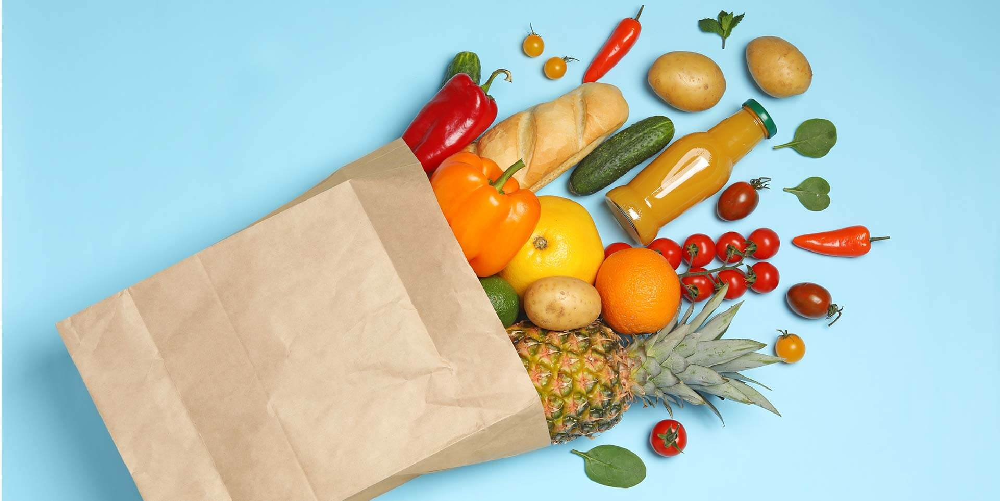
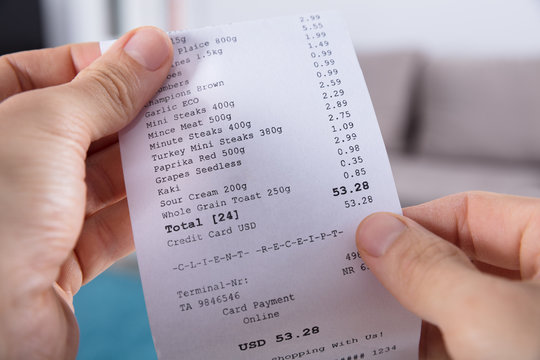
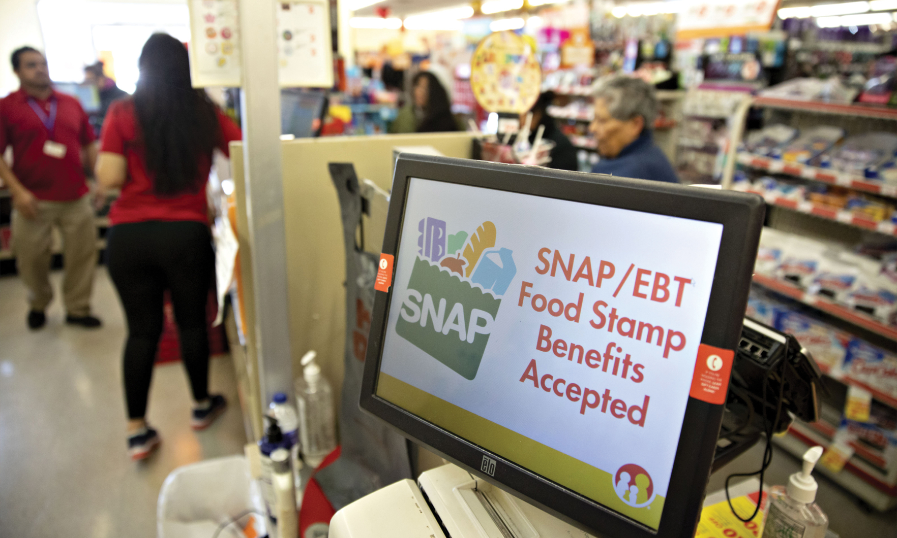

::: {#top-section}
:::

```{=html}
<!-- ══════════════════════════════════════════
     HERO
══════════════════════════════════════════ -->
<div class="hero">
  <span class="kicker">Economic Trends Analysis · 1960-Present</span>
  <h1>The Price of Eating</h1>
  <p class="dek">Has food gotten more or less affordable? How does this affect different types of food and different types of Americans?</p>
  <p class="byline"> 
    <a href="references.html">All Sources</a> ·
    <a href="tech_appendix.html">Technical Appendix</a> ·
    <a href="ai_log.html">AI Usage Log</a>
  </p>
</div>
```
::: {.prose}
::: {.chart-wrap}

[Source: @img_ubc_groceries]{.caption}
:::

## Introduction

Everyone has to eat. 

Along with water, shelter, and clothing, food is one of the most basic needs of every human being. 
According to the USDA Economic Research Service, there were over 115,000 food stores in the U.S. in 2019 [@usda_ers_retail_trends]. 
This number includes grocery stores, convienience stores, and specialty food stores, but doesn't include the over 618,000 restaurants as counted by the U.S. Census County Business Patterns program in 2023. [@cbp_restaurants]

If you look at the general trends of food expenditure in the U.S. since the 1960s, it is clear that Americans are spending less on food, both on groceries (or food at home), and at restaurants (or food away from home). The chart below shows how much the U.S. consumers are spending on food out of their total expenditure on all items, calculated as a percentage of annual rates per month from 1960 to 2026.

::: {.chart-wrap}
<iframe src="charts/percent_food_expenditure.html" width=1010 height=620 style="border:none"></iframe>
[Source: FRED DFXARC1M027SBEA and PCE Series, no inflation adjustment necessary since this is a percentage of nominal dollars for each year.]{.caption}
:::

Sixty-five years ago, Americans spent almost 20% of their total personal expenditures on food, while that number is down to about 7% in March 2026. 

When examining the cost of food over the past 6 decades, the chart below shows the Consumer Price Indexes for all food (groceries and restaurants) as compared to all items, relative to January 1960. This data shows that food prices tracked below general inflation for most of the 1960s, as well as from 1980 up until about 2010. At this time point, food prices begin to increase faster than general inflation, with a sharp surge in 2021–2022. 

::: {.chart-wrap}
<iframe src="charts/food_vs_overall_inflation.html" width=1010 height=620 style="border:none"></iframe>
[Source: FRED CPIUFDSL and CPIAUCSL Series, Consumer Price Index reindexed to Jan 1960=100.]{.caption}
:::

This shows us that in the long run, food is putting less of a dent in American wallets, but in recent years, food is becoming more expensive faster than everything else. 

What else are these numbers hiding? As aggregate metrics based on all of the U.S. or all types of eating, general spending or inflation metrics can hide the real story of the price of food in the U.S. 

Using data from the Federal Reserve Bank of St. Louis (FRED) and the USDA Economic Research Service Food Expenditure Series, this project aims to investigate food affordability and spending in the U.S. over time [@fred; @usda_ers_fes]. We illustrate the difference between categories of food and groceries to see if certain types of food are becoming cheaper or more expensive, as well as compare across income percentiles to investigate how these changes can affect people of different circumstances. Finally, we analyze food burden per state over time to further examine the inequality of cost-of-eating across the U.S.

::: {.chart-wrap}

[Source: Adobe Stock Images]{.caption}
:::

## Not All Food Is Created Equal 

The story of food affordability is really the story of _specific_ types of foods. This section we dive into the price and spending trends of different sectors of the food industry: food at home, which includes buying groceries at grocery stores, supermarkets, larger warehouse clubs like Costco or Sam's Club, and other stores like specialty markets, and food away from home, which includes buying premade food from restaurants, both sit-down or 'full-service' restaurants and fast-food or 'limited' restaurants. 

While the total food price index has approximately matched the overall price index until recently, the separate groceries price index versus eating out index tell a different story. The chart below shows that since the 1980s, eating out at any type of restaurant has become more expensive faster than buying groceries and cooking at home. 


::: {.chart-wrap}
<iframe src="charts/home_vs_away.html" width=1010 height=620 style="border:none"></iframe>
[Source: FRED CUUR0000SAF11 and CUUR0000SEFV Series, Consumer Price Index reindexed to Jan 1960=100.]{.caption}
:::

Despite eating out consistently increasing in price more than eating at home, when breaking down the food at home and food away from home categories further into sales by outlet, we can see that American food spending has changed in outlet over time. Grocery stores started with the highest share of total monthly food sales with over 40% in 1997, when this data became available. While grocery stores still maintains a slight plurality with about 25% of food sales at the end of 2024, both limited and full-service restuarants as well as warehouse club stores experienced a significant increase in their shares of food sales. In fact, based on the USDA ERS Food Expenditure Survey, in January 1997, 57.64% of food sales went to groceries and food at home, and 42.36% went to eating out (food away from home). While the food away from home share dropped to an extreme low during the pandemic (36.92% in April 2020), by December 2024 it had risen back up to 54.24%, surpassing grocery spending at only 45.76%. This means that even though eating out is getting less affordable, as shown by the price indexes above, more and more Americans are participating in it. The slider at the bottom of the chart below allows exploration of the share of food sales by outlet over time. 

::: {.chart-wrap}
```{python}
#| echo: false
#| cache: true

# import packages 

import numpy as np
import pandas as pd
import plotly.graph_objects as go
import plotly.express as px

# import data 

sales_by_outlet = pd.read_csv("../data/usda/monthly_sales_by_outlet.csv", low_memory=False)

# clean data 

# select columns 
sales_by_outlet_clean = sales_by_outlet[['Year',
                                   'Month',
                                   'Food-at-home sales at grocery stores (millions of nominal U.S. dollars)',
                                   'Food-at-home sales at warehouse clubs and supercenters (millions of nominal U.S. dollars)',
                                   'Other food-at-home sales (millions of nominal U.S. dollars)',
                                   'Food sales at full-service restaurants (millions of nominal U.S. dollars)',
                                   'Food sales at limited-service restaurants (millions of nominal U.S. dollars)',
                                   'Other food-away-from-home sales (millions of nominal U.S. dollars)',
                                   'Total food-at-home sales (millions of nominal U.S. dollars)',
                                   'Total food-away-from-home sales (millions of nominal U.S. dollars)',
                                   'Total food sales (millions of nominal U.S. dollars)']]

# rename columns 
sales_by_outlet_clean = sales_by_outlet_clean.rename(columns = {
    'Food-at-home sales at grocery stores (millions of nominal U.S. dollars)': 'grocery_stores',
    'Food-at-home sales at warehouse clubs and supercenters (millions of nominal U.S. dollars)': 'warehouse_supercenter',
    'Other food-at-home sales (millions of nominal U.S. dollars)': 'other_food_at_home',
    'Food sales at full-service restaurants (millions of nominal U.S. dollars)': 'full_restaurants',
    'Food sales at limited-service restaurants (millions of nominal U.S. dollars)': 'limited_restaurants',
    'Other food-away-from-home sales (millions of nominal U.S. dollars)': 'other_food_away',
    'Total food-at-home sales (millions of nominal U.S. dollars)': 'total_food_at_home',
    'Total food-away-from-home sales (millions of nominal U.S. dollars)': 'total_food_away',
    'Total food sales (millions of nominal U.S. dollars)': 'total_overall'
})

# combine year and month into date column 
sales_by_outlet_clean['date'] = pd.to_datetime(sales_by_outlet_clean['Month'] + ' ' + sales_by_outlet_clean['Year'].astype(str), format='%B %Y')
sales_by_outlet_clean['Date '] = sales_by_outlet_clean['date'].dt.strftime('%B %Y')

# convert sales to float 
sales_by_outlet_clean['grocery_stores'] = sales_by_outlet_clean['grocery_stores'].astype(str).str.replace(',', '', regex=False).astype(float)
sales_by_outlet_clean['warehouse_supercenter'] = sales_by_outlet_clean['warehouse_supercenter'].astype(str).str.replace(',', '', regex=False).astype(float)
sales_by_outlet_clean['other_food_at_home'] = sales_by_outlet_clean['other_food_at_home'].astype(str).str.replace(',', '', regex=False).astype(float)
sales_by_outlet_clean['full_restaurants'] = sales_by_outlet_clean['full_restaurants'].astype(str).str.replace(',', '', regex=False).astype(float)
sales_by_outlet_clean['limited_restaurants'] = sales_by_outlet_clean['limited_restaurants'].astype(str).str.replace(',', '', regex=False).astype(float)
sales_by_outlet_clean['other_food_away'] = sales_by_outlet_clean['other_food_away'].astype(str).str.replace(',', '', regex=False).astype(float)
sales_by_outlet_clean['total_food_at_home'] = sales_by_outlet_clean['total_food_at_home'].astype(str).str.replace(',', '', regex=False).astype(float)
sales_by_outlet_clean['total_food_away'] = sales_by_outlet_clean['total_food_away'].astype(str).str.replace(',', '', regex=False).astype(float)
sales_by_outlet_clean['total_overall'] = sales_by_outlet_clean['total_overall'].astype(str).str.replace(',', '', regex=False).astype(float)

# convert to percentage
sales_by_outlet_clean['percent_grocery_stores'] = (sales_by_outlet_clean['grocery_stores']/sales_by_outlet_clean['total_overall']) *100
sales_by_outlet_clean['percent_warehouse_supercenter'] = (sales_by_outlet_clean['warehouse_supercenter']/sales_by_outlet_clean['total_overall']) *100
sales_by_outlet_clean['percent_other_food_at_home'] = (sales_by_outlet_clean['other_food_at_home']/sales_by_outlet_clean['total_overall']) *100
sales_by_outlet_clean['percent_full_restaurants'] = (sales_by_outlet_clean['full_restaurants']/sales_by_outlet_clean['total_overall']) *100
sales_by_outlet_clean['percent_limited_restaurants'] = (sales_by_outlet_clean['limited_restaurants']/sales_by_outlet_clean['total_overall']) *100
sales_by_outlet_clean['percent_other_food_away'] = (sales_by_outlet_clean['other_food_away']/sales_by_outlet_clean['total_overall']) *100
sales_by_outlet_clean['percent_total_food_at_home'] = (sales_by_outlet_clean['total_food_at_home']/sales_by_outlet_clean['total_overall']) *100
sales_by_outlet_clean['percent_total_food_away'] = (sales_by_outlet_clean['total_food_away']/sales_by_outlet_clean['total_overall']) *100


# convert to long format
sales_by_outlet_long = sales_by_outlet_clean.melt(
    id_vars=['Year', 'Month', 'date', 'Date '],
    value_vars=[
        'percent_grocery_stores',
        'percent_warehouse_supercenter',
        'percent_other_food_at_home',
        'percent_full_restaurants',
        'percent_limited_restaurants',
        'percent_other_food_away',
        # 'total_food_at_home',
        # 'total_food_away',
        # 'total_overall'
    ],
    var_name='category',
    value_name='sales'
)


# sort values 
sales_by_outlet_long = sales_by_outlet_long.sort_values(by=['date','category'])

# add columns for hover data 
sales_by_outlet_long['Category '] = sales_by_outlet_long['category'].map({
    'percent_grocery_stores': ' Grocery Stores',
    'percent_warehouse_supercenter': ' Warehouse Clubs',
    'percent_other_food_at_home': ' Other, at Home',
    'percent_full_restaurants': ' Full Restaurants',
    'percent_limited_restaurants': ' Limited Restaurants',
    'percent_other_food_away': ' Other, Away from Home',
})
sales_by_outlet_long['Percentage '] = ' '+sales_by_outlet_long['sales'].round(2).astype(str)+"%"

# make plot 

# colors
color_map = {
    'percent_grocery_stores': "#458dbd",
    'percent_warehouse_supercenter': "#67a384",
    'percent_other_food_at_home': "#adddfc",
    'percent_full_restaurants': "#b84141",
    'percent_limited_restaurants': "#e38a72",
    'percent_other_food_away': "#e3b96b",
}

# plot 
fig = px.bar(sales_by_outlet_long, 
             x="category", 
             y="sales", 
             color="category",
             color_discrete_map=color_map,
             animation_frame="date",
             animation_group="category",
             range_y=[0,100],
             hover_name="Date ",
             hover_data={
                "Category ":True,
                "Percentage ":True,
                "category":False,
                "date":False,
                "sales":False
                },
             )

fig.update_traces(
    marker_line_width=0,
)


fig.update_layout(
    width=900, 
    height=600, 
    margin=dict(t=50),
    
    # title
    title={
        'text': 'Share of Food Sales by Outlet Type over Time',
        'x': 0.02,
        'xanchor': 'left',
        'font': {
            'size': 24,
            'family': 'Playfair Display',
            'color': '#f5f5f5'
        }
    },

    # plot background
    plot_bgcolor='#1a1a1a',

    # entire figure background
    paper_bgcolor='#1a1a1a',

    # x-axis
    xaxis=dict(
        title='Outlet Category',
        title_font=dict(
            size=17,
            family="Source Sans 3",
            color='#f5f5f5'
        ),
        tickfont=dict(
            size=12,
            color='#f5f5f5'
        )
    ),

    # y-axis
    yaxis=dict(
        title='Percentage of Total Food Sales (Monthly)',
        title_font=dict(
            size=17,
            family="Source Sans 3",
            color='#f5f5f5'
        ),
        tickfont=dict(
            size=16,
            color='#f5f5f5'
        )
    ),

    # legend
    showlegend=False
)

fig.update_xaxes(
    tickvals=[
        'percent_grocery_stores',
        'percent_warehouse_supercenter',
        'percent_other_food_at_home',
        'percent_full_restaurants',
        'percent_limited_restaurants',
        'percent_other_food_away'
    ],
    ticktext=[
        'Grocery Stores',
        'Warehouse Clubs',
        'Other, at Home',
        'Full Restaurants',
        'Limited Restaurants',
        'Other, Away from Home'
    ]
)

fig.update_yaxes(
    showgrid=True,
    gridcolor="rgba(255,255,255,0.08)",
    zerolinecolor="rgba(255,255,255,0.08)",
    tickfont=dict(size=12),
    ticksuffix="%"
)

for step in fig.layout.sliders[0].steps:
    step["label"] = step["label"][:7]

fig.update_layout(

    # animation slider
    sliders=[{
        'currentvalue': {
            'font': {'color': '#f5f5f5'},
            'prefix': 'Date: ',
            'visible': True,
        },

        # tick labels on slider
        'tickcolor': "rgba(245, 245, 245, 0.2)",

        # slider styling
        'bgcolor': '#1a1a1a',
        'bordercolor': "rgba(245, 245, 245, 0.5)",
        'borderwidth': 1,

        # font for slider step labels
        'font': {
            'color': "rgba(245, 245, 245, 0.5)",
        }
    }],

    # buttons
    updatemenus=[{
        'type': 'buttons',

        'font': {
            'color': "rgba(245, 245, 245, 0.5)",
        },

        'bgcolor': '#1a1a1a',
        'bordercolor': "rgba(245, 245, 245, 0.5)",

    }]
)

fig.show()
```
[Source: USDA, ERS Food Expenditure Survey, total monthly sales by outlet as a percent of total monthly food sales in millions of nominal U.S. dollars.]{.caption}
::: 

When decomposing grocery prices further into categories, the ones that are cheaper may not be the healthiest. The chart below shows how the prices of different grocery items have changed relative to those in 1967. While all items became more expensive at about the same rate until 1975, nonalcoholic beverage items became significantly more expensive from then until about the 1990s. Since then, it is clear to see that fruits and vegetables are the most expensive food category relative to other categories' prices. Since this data is not seasonally adjusted, the fruits and vegetables series shows the most cyclic variation, which is expected due to the different growing seasons of fresh food. Interestingly, the prices for meat, poultry, fish, and egg items have increased the least. That being said, the red line shows large non-cyclic variability, meaning that meat and other protein prices are the most volatile. 

::: {.chart-wrap}
<iframe src="charts/grocery_categories.html" width=1010 height=620 style="border:none"></iframe>
[Source: FRED CUUR0000SAF111, CUUR0000SAF112, CUUR0000SAF113, CUUR0000SAF114 Series, Consumer Price Index reindexed to Jan 1967=100.]{.caption}
:::

While no grocery category has been spared from major inflation since the 1960s, the foods that require the least industrial processing and are a major sector of a heathly diet, fruits and vegetables, have consistently gotten relatively more expensive than the ones that require the most.

::: {.chart-wrap}

[Source: Getty Images, @img_jhu_snap]{.caption}
:::

## Affordable for Who?

While everyone has to eat, many Americans cannot afford to. In fact, 47.9 million people lived in food-insecure households in 2024, meaning that they lived in households that unable or uncertain about having enough food for all their members at times during the year, due to insufficient money or other resources [@usda_ers_food_security]. Thus, it is important to consider food affordability and how it affects people of different income levels. 

The aggregate price trends above describe the environment all Americans share. A 25% spike in grocery prices is an inconvenience for a household spending 7% of its income on food. For a household spending 30%, it's a crisis.

The chart below shows the percentage of income before taxes that was spent on groceries (food at home) compared across 40 years, between 1984 and 2024, as well as 3 different income levels, using data from the Bureau of Labor Statistics Consumer Expenditure Survey via FRED. The usage of income before taxes is due to availability of data, since it is the most consistently reported figure across income quintiles. That being said, it can slightly understate the food spend percentage for lower-income households because the pre-tax income is higher than what they actually have to spend. According to the consumer expenditure survey, the income before taxes value includes SNAP benefits, Social Security, unemployment compensation, and other transfer income, so the denominator reflects total resources available to the household, not just earned wages [@bls_ce_income]. This makes the percentage a genuine measure of food's claim on all available resources. The limitation is that income before taxes does not account for taxes paid, meaning it slightly overstates available resources for households that pay significant taxes, which is primarily the middle and upper quintiles rather than the bottom. That being said, the disparity is clear: households in the bottom 20% based on average annual pre-tax income spent about over a third of it on groceries in 1984, and that percentage only decreased to about a quarter in 2024. On the other hand, households in the 41st to 60th percentile (middle 20%) spent about 11% of their pre-tax income on food in 1984, and about 8% in 2024. The top 20% of households are much less affected my food expenditure, only spending 5% in 1984 and 3.5% in 2024. 

::: {.chart-wrap}
<iframe src="charts/bar_grocery_income.html" width=1010 height=620 style="border:none"></iframe>
[Source: FRED CXUFOODHOMELB0102M, CXUFOODHOMELB0104M, CXUFOODHOMELB0106M, CXUINCBEFTXLB0102M, CXUINCBEFTXLB0104M, CXUINCBEFTXLB0106M Series, Food at Home Expenditures and Income Before Taxes by Quintiles of Income Before Taxes.]{.caption}
:::

Despite drops in food spending percentage for all three, the burden gap between income groups has persisted. Thus, the increased grocery prices can affect low-income households' abilities to obtain enough nourishing food more than middle- and high-income households. 

The line chart below provides a more nuanced view of the result above. The bottom income quintile has consistently devoted a far larger and more volatile share of income to groceries than middle- or upper-income households, and that gap has not meaningfully closed over 40 years.

::: {.chart-wrap}
<iframe src="charts/line_grocery_income.html" width=1010 height=620 style="border:none"></iframe>
[Source: FRED CXUFOODHOMELB0101M, CXUFOODHOMELB0102M, CXUFOODHOMELB0104M, CXUFOODHOMELB0106M, CXUINCBEFTXLB0101M, CXUINCBEFTXLB0102M, CXUINCBEFTXLB0104M, CXUINCBEFTXLB0106M Series, Food at Home Expenditures and Income Before Taxes by Quintiles of Income Before Taxes.]{.caption}
:::

While income differences are significant, the same national price trends can play out very differently across states as well. In high-income, food represents a manageable fraction of what residents earn. In lower-income states, that fraction is higher and far more vulnerable to price shocks.

The map below, states are colored by per capita food sales as a share of per capita personal income by state, from 1997 to 2024, when state-level food sales data is available. Higher values and lighter colors indicate greater food burden, or more personal income spent on food. In this case, food sales refer to all food, both food at home and away from home. The slider at the bottom allows exploration of state food burden over time. 

::: {.chart-wrap}
<iframe src="charts/map_food_sales_income.html" width=1010 height=620 style="border:none"></iframe>
[Source: USDA, ERS Food Expenditure Survey, total annual per capita food sales by state, as a percent of annual per capita personal income by state in U.S. dollars, via FRED.]{.caption}
:::

Across the entire timeline, Nevada has consistently the highest values of food burden, with all values between 12 and 15 percent (except for 2020, when food sales dropped due to the pandemic, especially food away from home). More recently, states in the American South and Hawaii also show slighter higher percentages, while states like New York, Connecticut and New Jersey have consistently lower burden, with between 6% and 8% of per capita personal income spent on food. 

When calculating food at home per capita sales as a percentage of per capita personal income, states range over time from a minimum of 2.1% spending on food at home (Washington, D.C. in 2007) to a maximum of 8.5% (Washington state in 2017). Food away from home similarly ranges from 2.7% (Connecticut in 2001) to 9.2% (Hawaii in 2024). The table below shows the states with the two highest and two lowest average food burden across total, food at home, and food away from home. 


| Rank | Average Total Food Burden | Average Food at Home Burden | Average Food Away from Home Burden |
|---|---|---|---|
| Highest | Nevada (13.10%) | Maine (6.65%) | Hawaii (7.77%) |
| Second Highest | Hawaii (12.40%) | Utah (6.25%) | Nevada (7.77%) | 
| Second Lowest | New York (7.13%) | New York (3.44%) | New Jersey (3.41%) |
| Lowest | Connecticut (6.65%) | District of Columbia (2.42%) | Connecticut (3.14%) | 

As seen from the map and the table, states like Hawaii and Nevada seem to have high food burdens, but this is mainly due to high food away from home spending, potentially from the high volume of tourists these states see. States like Maine and Utah have the highest average food at home burdens, which means that residents in these states might be more affected. 

::: {.chart-wrap}

[Source: @img_ncoa]{.caption}
:::

## Conclusions and Looking Forward 

Overall, these results will affect everyone's budgets and decisions on what to eat. America's food industry has delivered affordability gains over the past six decades, since food represents a smaller share of total spending than at any point recent history, and overall food prices tracked below or with general inflation for most of the 1980s through 2010s. But this project has shown that these aggregates conceal more than they reveal. 

First, eating out has become increasingly more expensive than buying groceries and cooking at home, and it has recently surpassed food at home as a percentage of total food sales. Second, the groceries that got most expensive are integral for a balanced, healthy diet. Fruits and vegetables have consistently outpaced other grocery categories' inflation, while processed cereals, packaged goods, and beverages increased with inflation but not as sharply. Meat and protein sources remain the most volatile within grocery pricing, so while they may be relatively cheaper than other grocery categories, they are harder to budget for consistently. Third, the affordability gains have been deeply unequal: the bottom income quintile spent over a third of their pre-tax income on groceries in 1984, and still spends about a quarter today, while the highest quintile has consistently spent 5% or less of their pre-tax income for the past 40 years. 

### Policy Recommendations

***Resist aggregate measures in food cost and policy assessment.*** 

The national average food expenditure share is a very commonly cited metric of food affordability. This project demonstrates that it is also a misleading one. Policy assessments and discussions of food affordability should be sure to disaggregate by income quintile, since the average experience describes the top half of the income distribution far better than the bottom.

***Expand nutrition assistance programs to reflect how Americans actually eat.*** 

The Supplemental Nutrition Assistance Program (SNAP) is one of the most important assistance programs for food insecurity in the U.S. In 2024, an average of 41.5 million people per month received SNAP benefits [@fns_snap_data]. SNAP benefits are currently restricted almost entirely to grocery purchases, food intended to be prepared at home. Yet this project shows that food away from home now accounts for the majority of American food spending, having grown from 42% of total food sales in 1997 to over 54% by 2024, even as restaurant prices have consistently outpaced grocery inflation. For low-income households, who already devote a disproportionate share of income to food, the inability to use nutrition assistance at affordable prepared food outlets like certain fast food restaurants creates a mismatch between how the benefit works and how food purchasing actually functions in modern American life. Several states have specific SNAP Restaurant Meals Programs allowing elderly, homeless, and disabled SNAP recipients to use benefits at participating restaurants, but this is not universal nor easily accessed [@fns_restaurant_meals_program]. Expanding this model more broadly, particularly in food desert geographies where grocery access is limited, would align policy with the realities documented in this data.

***Target food access research and investment toward high-burden states.*** 

This project's state-level analysis shows geographic inequality in food burden. States with consistently high food burden ratios and high food at home burden ratios, like Maine, Montana, Idaho, and others with high rural populations, should be the focus of further food burden and access research. Based on these results, federal investment in food access infrastructure can be targeted where it is most necessary.

### Limitations

This analysis has several important constraints that should inform how findings are interpreted.

The Consumer Expenditure Survey quintile data begins in 1984, limiting the inequality analysis to a 40-year window rather than the full six decades examined in the introduction. The pre-1984 period cannot be disaggregated by income group with the same methodology.

Income before taxes is used as the denominator in the food burden ratio. Like mentioned before, it slightly overstates available resources for households who pay taxes, but it does include benefits like Social Security and SNAP. Because of this, a more "true" food burden based on actual disposable income may differ slightly from the figures shown, especially for higher quintiles. Disposable income data per quintile over time was not easily accessible within the scope and timeline of this project. 

The state-level analysis uses per capita food sales divided by per capita personal income, which captures the average experience within a state but cannot distinguish high-burden households within otherwise affluent states. A state like 
New York or Connecticut may have a low average food burden while still containing significant pockets of food insecurity.

The outlet sales data from USDA ERS begins in 1997, limiting the historical scope of the spending-by-outlet analysis. Changes in how Americans shopped for food before 1997 are not captured.

### Future Research

Several dimensions of food affordability are beyond the current scope and timeline of this project but represent important directions for further investigation.

***Nutritional cost analysis.***

This project shows that certain foods have inflated faster in price terms, but does not quantify the cost per nutrient or per calorie, or if different income groups purchase different types of food. It would be interesting to develop an inequality-focused analysis on nutrition affordability as a continuation of this work. 

***The role of SNAP in closing the burden gap.***

The inequality analysis uses pre-tax income and does not dive into the effects of SNAP benefits on the food burden ratio for the bottom quintile. A follow-on analysis incorporating SNAP participation and benefit levels would show whether the program has meaningfully offset the persistent high burden of the lowest income group. 

***Sub-state geographic granularity.***

The choropleth map shows state-level patterns but cannot capture county or census-tract level variation. Combining 
the USDA Food Access Research Atlas with county-level income and or demographic data would reveal whether the high-burden states identified here have concentrated food affordability crises in specific regions or whether they are distributed broadly across the state or other demographic characteristics.
:::

[Back to Top](#top-section){.back-btn}
